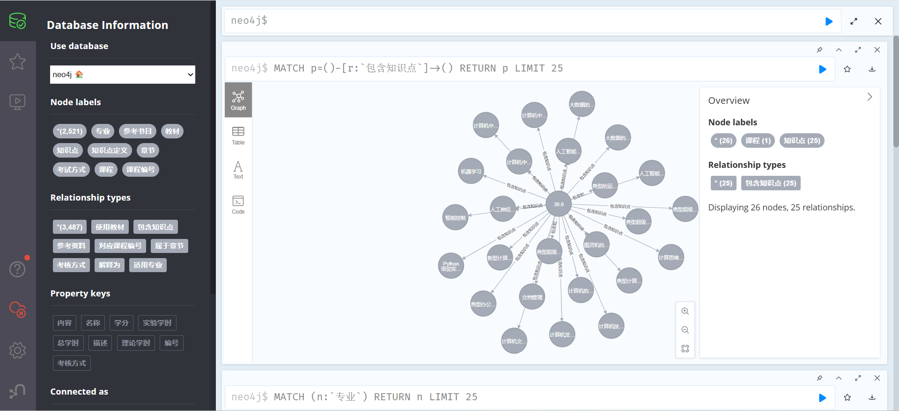
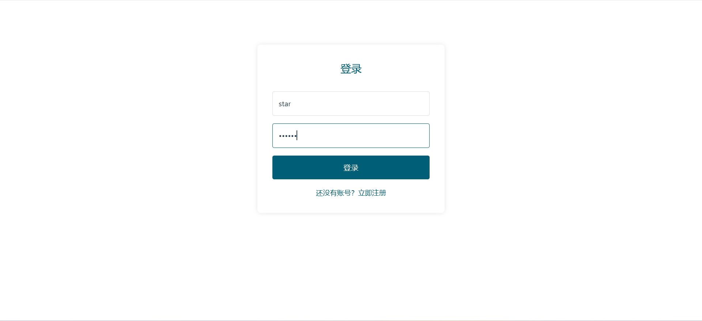
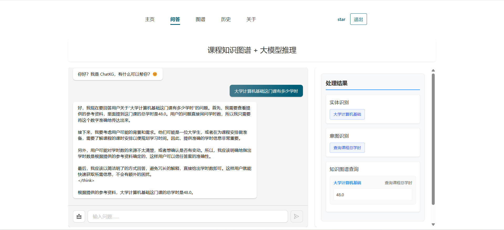
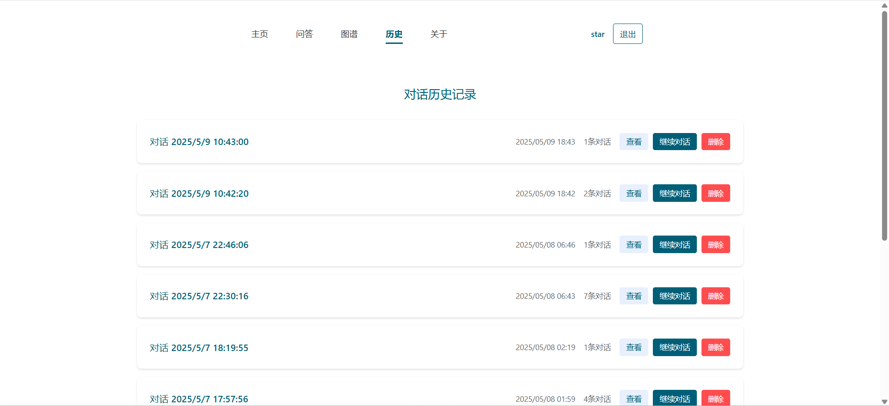
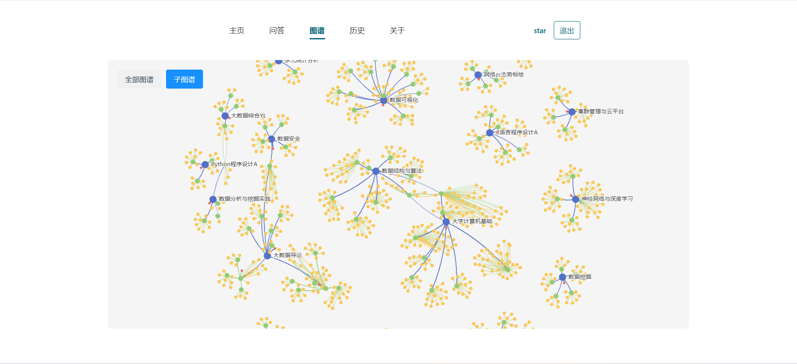

# 📚 课程知识图谱构建与查询

本项目旨在构建和查询大学课程相关的知识图谱，包括课程、章节、知识点及其相互关系。通过该知识图谱，可以实现对课程内容的系统化展示、关联性查询和知识点追溯。

## 📦 **文件结构：**

```
/KGLLM/
│── build_kg/
│   ├── data          	   # 课程数据
│   └── build_kg.py	   #创建知识图谱
│   └── add_course_kg.py   #更新知识图谱
│   └── pdf2txt.py         #OCR识别工具
│   └── intent.py   	  #意图识别模块
│   └── entity.py         #实体识别模型
│── kgweb/
│   ├── public      	    # 网页资源
│   ├── src       	   # 前端页面
│   ├── vite.config.js        # 后端api
│── server/
│   ├── data      	    # 知识图谱展示数据
│   ├── app       	   # 后端服务
│   ├── main.py        # 后端启动

│── requirements.txt          # 依赖库
│── README.md                 # 项目说明文件


```

## 🛠️ 功能模块

### **1. 数据导入模块：**

* 从 Excel 文件或数据库中导入课程、章节、知识点等数据。
* 支持多学科、多课程的数据格式化导入。

### **2. 知识图谱构建模块：**

* 基于 **Neo4j** 数据库构建知识图谱。
* 节点类型：

  * **课程 (Course)：** 课程名称、学分、学时、考核方式等属性。
  * **章节 (Chapter)：** 章节编号、名称。
  * **知识点 (Knowledge Point)：** 知识点名称、定义、所属章节。
  * **知识点定义 (Concept)：** 知识点详细定义和解释。
* 关系类型：

  * **包含 (CONTAINS)：** 课程包含章节、章节包含知识点。
  * **定义为 (DEFINED\_AS)：** 知识点定义。
  * **先修 (PRE\_REQUISITE)：** 前置课程或知识点。
  * **应用于 (APPLIED\_IN)：** 知识点应用于课程中的具体章节。

---

### **3. 数据查询模块：**

* 基于 **Cypher 查询语言**，可实现以下查询：

  * **课程信息查询：**

    * 查询课程名称、学分、学时等信息。
    * 示例：

      ```cypher
      MATCH (c:课程 {名称: '数据结构'})
      RETURN c.名称, c.学分, c.学时, c.考核方式
      ```
  * **章节与知识点查询：**

    * 查询指定课程中的所有章节及其知识点。
    * 示例：

      ```cypher
      MATCH (c:课程)-[:包含]->(ch:章节)-[:包含]->(kp:知识点)
      WHERE c.名称 = '数据结构'
      RETURN ch.名称, kp.名称
      ```
  * **知识点定义查询：**

    * 查询知识点的定义及其关联章节。
    * 示例：

      ```cypher
      MATCH (kp:知识点)-[:定义为]->(def:知识点定义)
      WHERE kp.名称 = '链表'
      RETURN kp.名称, def.内容
      ```
  * **路径查询：**

    * 查询知识点之间的路径，用于分析知识点的关联性。
    * 示例：

      ```cypher
      MATCH path = (kp1:知识点)-[*]->(kp2:知识点)
      WHERE kp1.名称 = '树' AND kp2.名称 = '二叉树'
      RETURN path
      ```

---

### **4. 基于知识图谱检索增强的大模型问答：**

* 实体识别
* 意图识别
* 知识图谱查询（单跳、多跳推理）
* 构建基于思维链的prompt，实现检索增强

---

## ✅ **环境依赖：**

* **Python 3.8+**
* **Neo4j 5.x**
* **py2neo**
* **pandas**
* **numpy**
* **networkx**

安装依赖：

```bash
pip install -r requirements.txt
```

---

## 🚀 **启动方法：**

1. **启动 Neo4j 数据库：**

   * 启动 Neo4j：

     ```bash
     neo4j start
     ```
   * 在浏览器访问 [http://localhost:7474](http://localhost:7474) 并输入用户名和密码进行登录。

---

2. **数据导入：**

   * 将课程数据导入 Neo4j：

     ```bash
     python build_kg.py 
     ```




---

3. **启动前端：**

   * 安装vue所需依赖

   ```bash
   cd webkg
   npm install
   ```

   * 启动

   ```bash
   npm run dev
   ```

   4. **启动后端服务：**

   ```bash
   python main.py
   ```







---

## 🔍 **界面展示**

| 课程名称 | 学分 | 总学时 | 章节名称 | 知识点名称     | 知识点定义                     |
| -------- | ---- | ------ | -------- | -------------- | ------------------------------ |
| 数据结构 | 4    | 64     | 栈       | 栈的定义       | 栈是一种先进后出的数据结构     |
| 数据结构 | 4    | 64     | 队列     | 队列的基本操作 | 队列是一种先进先出的数据结构   |
| 操作系统 | 3    | 48     | 进程管理 | 进程的定义     | 进程是程序在计算机中的执行实体 |


---

## 🛠️ **开发计划：**

* ✅ 数据导入模块实现（支持 Excel 和 CSV 文件）
* ✅ 基础查询功能实现（基于 Cypher 查询语言）
* ✅ 知识点覆盖度分析模块开发
* 🔄 知识点路径回溯分析
* 🔄 数据可视化（基于 networkx 和 matplotlib）
* 🔄 多语言查询支持（中文 / 英文）

---

## 🤝 **贡献指南：**

1. **Fork 本仓库。**
2. **创建新分支：**

   ```bash
   git checkout -b feature/your-feature
   ```
3. **提交代码：**

   ```bash
   git commit -m "新增功能：xxx"
   ```
4. **提交合并请求：**

   * 在 GitHub 上发起 Pull Request，描述功能或修改点。

---

## 📧 **联系作者：**

* 作者：star
* 邮箱：[2](mailto:example@example.com)824103539@qq.com
